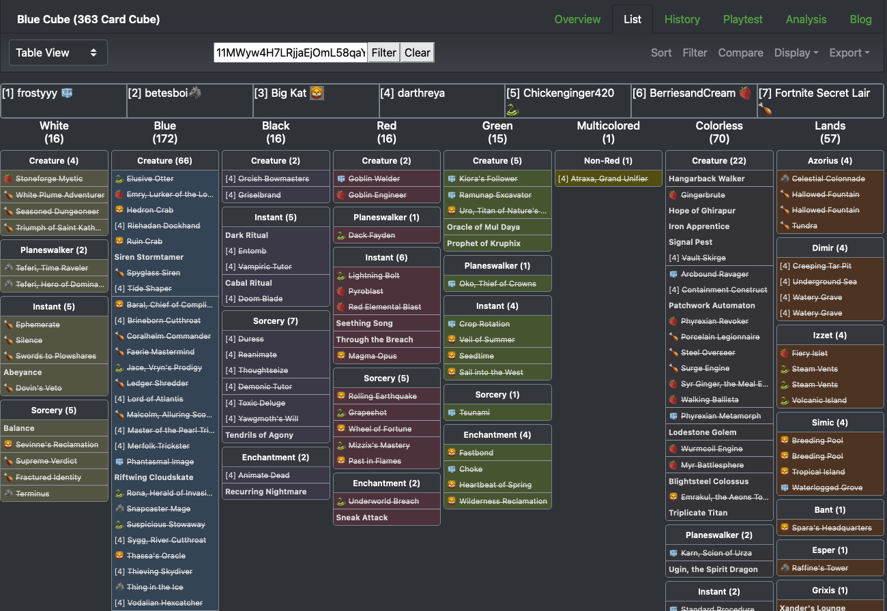
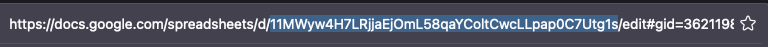

# cubeRotoDraftScript

A [TamperMonkey](https://www.tampermonkey.net/) script that shows picks made so far in a roto draft when using the [Lucky Paper Rotisserie Draft google sheet](https://docs.google.com/spreadsheets/d/1eQXIBS-C5I1ramqJ43ow8QMV-hvNXtW_Zon_ZQuxvRs/edit#gid=362119828).
This script runs locally on your browser and requires the draft sheet to be publicly readable.

## Features!
1. Top bar shows pick order and current picker
2. Auto-refreshes every 2 minutes! (soon to be toggleable)
3. Emoji detection! Add an emoji at the end of each name to show next to each pick

## Installation

1. Install TamperMonkey if you haven't already.
2. Open the [raw script file](https://github.com/darthreya/cubeRotoDraftScript/raw/main/script.user.js). 
   TamperMonkey should recognize it as a userscript and ask if you want to install it.

## Usage

1. Open your rotisserie draft google sheet
2. Copy the spreadsheet id from your url bar.
   
3. Go to your draft list. (https://cubecobra.com/cube/list/blue-cube)
4. Paste the spreadsheet id into the input
5. Press Filter or `Enter` key to display 